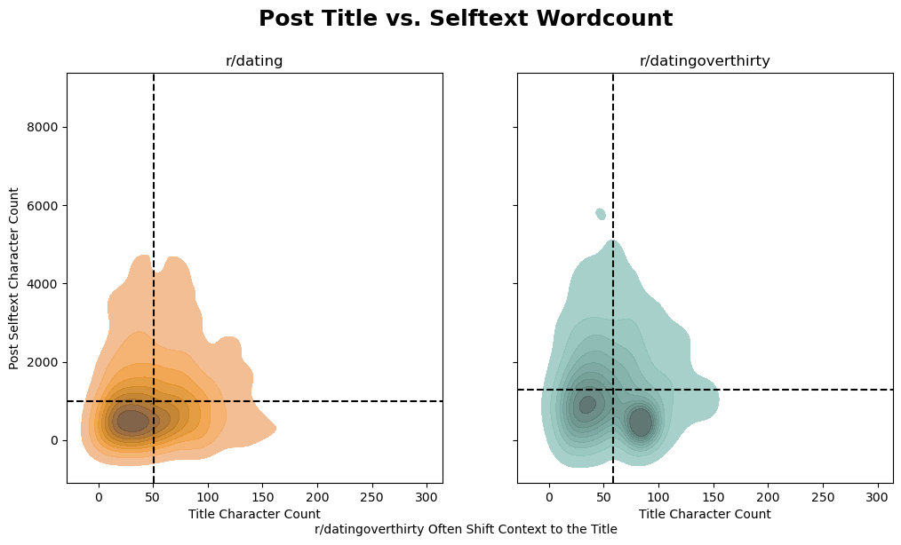
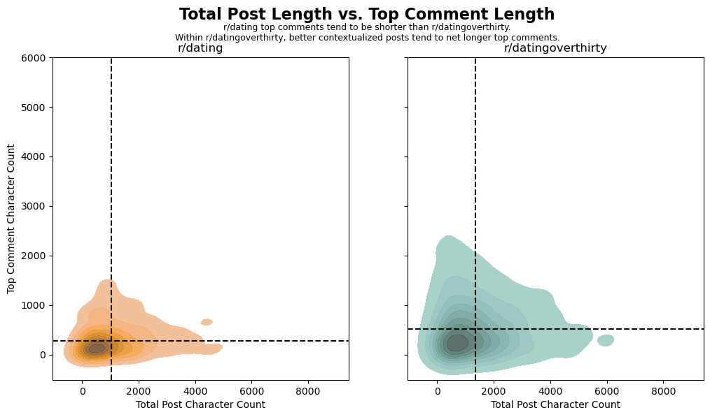

# Predicting Subreddit Classification via Natural Language Processing
Reddit data extracted via Praw, focused on r/dating vs. r/datingoverthirty

Robert Adams for General Assembly - Data Science Immersive - Summer 2023

---
## Problem Statement
The world of dating has become increasingly complicated with the proliferation of dating apps, recent in-person meeting restrictions, and various societal pressures.  In addition to services used to find 'matches', forums (including many on Reddit) have grown to facilitate discussion, support and advice.  Two popular forums are [r/dating](https://reddit.com/r/dating) and [r/datingoverthirty](https://reddit.com/r/datingoverthirty).  This project analyzes the text (post titles, selftext, and the top-upvoted comment) from 1000 recent posts from each community to predict in which subreddit new conversations are most likely to take place.

> Are the conversations happening on r/dating and r/datingoverthirty materially different in content - and can the designation be predicted?

***Background***: [Reddit](https://reddit.com) is a leading social media platform comprised of nearly 500 million monthly active users [[1](https://abcnews.go.com/US/wireStory/despite-widespread-protest-reddit-ceo-company-negotiating-3rd-100151379#:~:text=With%20more%20than%20500%20million,of%20the%20internet's%20top%20sites)], participating in subject-area forums called 'subreddits', designated as 'r/communityname'.  Users creating posts, which contain a title, selftext, and any relevant links, images or videos.  Other users participate in discussions in comments, often in threads.  In 2020, users created over 2 billion comments [[2]('https://www.redditinc.com/blog/reddits-2020-year-in-review/')].

In June 2023, Reddit's executive team elected to increase the cost of their API services for third party users, including third party app creators and subreddit moderators.  This caused moderator teams of a large portion of Reddit's communities to restrict access, restrict new posts, or to otherwise change the operations of their communities on the platform [[3](https://www.nbcnews.com/tech/tech-news/reddit-communities-end-blackout-protest-tensions-rcna89777)].  This project was launced in the days immediately preceding this protest, which yielded the following considerations:
1. The most common API used for this type of project ([Pushshift API](https://reddit-api.readthedocs.io/en/latest/)) was shut down by Reddit Administrators.  [The Praw API](https://praw.readthedocs.io/en/stable/) was used in its place, including applicable rate limits (1000 posts per pull).
1. One of the subreddits considered (r/datingoverthirty) became private at the discretion of the moderators.  This blocked access to additional posts.  The initial pull of 1000 posts and associated top comments were used to not create a class imbalance in the model.

***Citations***:
1. [ABC News (GRANTHAM-PHILIPS)](https://abcnews.go.com/US/wireStory/despite-widespread-protest-reddit-ceo-company-negotiating-3rd-100151379#:~:text=With%20more%20than%20500%20million,of%20the%20internet's%20top%20sites) - Reddit Monthly Active Users
1. [Reddit Inc. - 2020 year in review.](https://www.redditinc.com/blog/reddits-2020-year-in-review/) - Reddit Annual Comment counts and statistics.
1. [NBC News (Khogeer, Tenbarge)](https://www.nbcnews.com/tech/tech-news/reddit-communities-end-blackout-protest-tensions-rcna89777) - Reddit Protests and executive response.

---
## Data
Data used in this project was sourced from two subreddits: [r/dating](https://reddit.com/r/dating) and [r/datingoverthirty](https://reddit.com/r/datingoverthirty) on June 11th, 2023, focused on newly created posts to assess conversations thorughout their lifecycle.  On reddit, every post starts out new, gaining visibility with user interaction.

### Sourcing Details - PRAW API
#### [Post Sourcing](./code/01_Data_Sourcing.ipynb###-Content-Extraction)
With Pushshift API shut down by Reddit Administrators, the official Reddit API ([The Praw API](https://praw.readthedocs.io/en/stable/)) was leveraged.  Praw restricts the number of posts which can be returned on each get request to 1000 (as a maximum).  Requests can be made against each of the sort views available to users on Reddit.com: 
1. ***New*** - Posts are sorted such that the newest created post is at the top of the listing (reverse chronological order)
1. ***Top*** - Posts are sorted such that the posts which have earned the most upvotes (by upvote-downvote ratio) from users since creation are at the top of the listing (most popular)
1. ***Hot*** - Posts which have recently earned the most upvotes are at the top of the listing (active and popular)
1. ***Controversial*** - Posts which have earned the most upvotes _and downvotes_ are at the top of the listing (high engagement, even split of up/down votes)

The project code is set up to pull 1000 unique posts per subreddit from each of these filters, including duplicate handling (Hot posts can also be Top or New).  ***NOTE***: Due to various subreddits shutting down access (specifically, [r/datingoverthirty](https://reddit.com/r/datingoverthirty)), only 1000 posts were captured prior to access being restrited.  Increased sample size is available from r/dating, but this would cause unbalanced classes.

#### [Post Comments](./code/01_Data_Sourcing.ipynb#####-Top-Comment-Extraction)
To maximize learning from each post, the top upvoted comment for each post (where applicable) was also sourced.  This provides a picture of the posters' full question _and the most popular community response_.  Automated moderator posts and advertisements are removed from consideration.

### Data Dictionary
Data used in modeling is available in the repository in csv format [here](data/reddit_post_data.csv/).  Please note, though Reddit is largely anonymous, and redditors are usually adept at restricting personally identifiable information (PII), some PII may still be present in the data as posted in title, selftext, or comment text.

|Feature|Type|Description|
|---|---|---|
|subreddit|string|The subreddit where the post was created (dating, datingoverthirty) ***Note***: dating is mapped to 0; datingoverthirty is mapped to 1 for modeling.|
|id|string|Unique Identifier of the post - used to manage duplicates and isolate top comments.|
|created_utc|datetime|Datetime of post creation (UTC / GMT time)|
|title|string|The title of the post as created by the poster.  This is typically shorter.|
|selftext|string|Post description - created by the poster at submission.  This is typically the bulk of the content posted, including context and details.|
|top_comment_text|string|Text from the top upvoted comment on the post at the time data was pulled.  This roughly encapsulates the community response (or the response the community wants the poster to see).|
|self_text_and_comment|string|A combination of title, selftext, and top_comment_text data Provides a single view into the conversation of the post.|

---
## [Exploratory Data Analysis](./code/02_EDA.ipynb)
#### [Comment Length](./code/02_EDA.ipynb##-Submission-and-Top-Comment-Length-Profiles)
When seeking advice, context is key - understanding what the requester values, their perspectives and relevant events help drive engagement with the community in good faith.  Here I created a distribution plot of post titles, selftext, and top comment text by subreddit.  This is split by character count and word length, which provides another view - are the vocabularies used in each community different (ex. does r/dating use larger words in conversation?)

***Interpretation***
> r/datingoverthirty post titles have a distinct bimodal length, and are generally longer than r/dating in both word count and character count.  The difference in distributions between word and character counts indicates that, at least in pot titles, r/datingoverthirty may be writing longer statements using shorter words overall (including age descriptors like \[M34\])

> r/dating is more succinct in both selftext and top comment than r/datingoverthirty.

Overall, r/datingoverthirty appears to generally provide more context in titles, selftext, and in top voted comments than r/dating.

---
#### [Post Context - Quantitity and Distribution](./code/02_EDA.ipynb####-Post-Context\:-Quantity-and-Distribution)
The above visual indicates a distinct bimodal distribution with respect to title length in r/datingoverthirty.  Understaning whether users are providing more of the post content in the title vs. the selftext is key in understanding which data points to use in modeling (if half of the story for a significant portion of one subreddit is in the title, this may need to be considered.).  

***Interpretation***
> A KDE Plot is provided to highlight the shift in content between title and selftext, as identified by the diamond patterns around the title and selftext mean lengths for each subreddit.  If longer selftexts were associated with longer titles, a stronger distribution towards the top right would be prevail.  Title + selftext may be necessary to properly categorize posts.

---
#### [Post Context - Impact on Comment Length](./code/02_EDA.ipynb###-Top-Comments:-Do-more-contextualized-submissions-net-more-contextualized-comments\?)
Looking at community response to a post is key to understanding whether comment text may be impactful in classifying posts (or conversations) by subreddit.  Here I explore whether longer posts (title + selftext) is associated with longer (better contextualized) top comments.

***Interpretation***
> The KDE plots below show that shorter posts tend to return longer top comments.  For r/dating, the peak distribution of top comment length is approximately at the mean post length.  For r/datingoverthirty, this peak happens around 750 characters (well below the mean post length).  It is possible better contextualized posts (longer) do not yield as many comments, or the answers to a well formed question may be simple.

If post title, selftext and comments are included, the lengths should generally normalize for each subreddit.

---
#### [Sentiment Analysis](./code/02_EDA.ipynb###-Sentiment)
Understanding the tone of the conversations in each subreddit may illustrate the differences in how users leverage these forums - and potentially preview model performance.  nltk's SentimentIntensityAnalyzer is leveraged to calculate a composite sentiment score for each title, selftext, and comment.  Here, -1.5 is extremely negative, while 1.5 is glowingly positive.  KDE Plots are used to differentiate subreddits.

***Interpretation***
> Post titles skew slightly positive for r/dating; a bit negative for r/datingoverthirty, drawn netative by a spike near -0.5.  This indicates r/datingoverthirty posters may be leveraging the title to vent - it should also be noted there is a spike in longer post titles in this subreddit.  Longer posts may tend to skew more negative.

> Post selftext is generally positive, but again we see a frustration spike below the mean for r/datingoverthirty.

> Top Comments indicate users commenting within these subreddits are supportive, especially in r/datingoverthirty.  

---
#### [Sentiment Shift](./code/02_EDA.ipynb####-Sentiment-Shift:-Are-top-comments-more-or-less-supportive-by-community\?)
dfgh

> The top comment on _r/datingoverthirty_ appears to skew generally positive - and more positive than the original post text.  Both subreddits follow this trend, but the improvement in sentiment of the top comment from the original post (average of title and selftext) is twice as prevalent on r/datingoverthirty.
---
## Model Selection

### Model Performance

## Executive Summary

## Recommendations