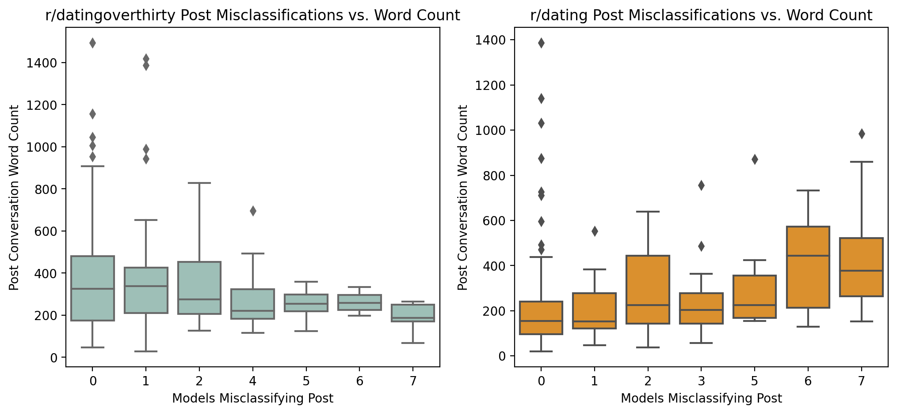

# Predicting Subreddit Classification via Natural Language Processing
##### Reddit data extracted via Praw, focused on r/dating vs. r/datingoverthirty
##### Bob Adams - June 2023
---
## Problem Statement
The world of dating has become increasingly complicated with the proliferation of dating apps, recent in-person meeting restrictions, and various societal pressures.  In addition to services used to find 'matches', forums (including many on Reddit) have grown to facilitate discussion, support and advice.  Two popular forums are [r/dating](https://reddit.com/r/dating) and [r/datingoverthirty](https://reddit.com/r/datingoverthirty).  This project analyzes the text (post titles, selftext, and the top-upvoted comment) from 1000 recent posts from each community to predict in which subreddit new conversations are most likely to take place.  Models will be optimized to maximize accuracy - posting in the wrong subreddit carries little risk, but posting in the correct one may help bring the right answer.

> Are the conversations happening on r/dating and r/datingoverthirty materially different in content - and can the designation be predicted?

***Background***: [Reddit](https://reddit.com) is a leading social media platform comprised of nearly 500 million monthly active users [[1](https://abcnews.go.com/US/wireStory/despite-widespread-protest-reddit-ceo-company-negotiating-3rd-100151379#:~:text=With%20more%20than%20500%20million,of%20the%20internet's%20top%20sites)], participating in subject-area forums called 'subreddits', designated as 'r/communityname'.  Users creating posts, which contain a title, selftext, and any relevant links, images or videos.  Other users participate in discussions in comments, often in threads.  In 2020, users created over 2 billion comments [[2]('https://www.redditinc.com/blog/reddits-2020-year-in-review/')].

In June 2023, Reddit's executive team elected to increase the cost of their API services for third party users, including third party app creators and subreddit moderators.  This caused moderator teams of a large portion of Reddit's communities to restrict access, restrict new posts, or to otherwise change the operations of their communities on the platform [[3](https://www.nbcnews.com/tech/tech-news/reddit-communities-end-blackout-protest-tensions-rcna89777)].  This project was launced in the days immediately preceding this protest, which yielded the following considerations:
1. The most common API used for this type of project ([Pushshift API](https://reddit-api.readthedocs.io/en/latest/)) was shut down by Reddit Administrators.  [The Praw API](https://praw.readthedocs.io/en/stable/) was used in its place, including applicable rate limits (1000 posts per pull).
1. One of the subreddits considered (r/datingoverthirty) became private at the discretion of the moderators.  This blocked access to additional posts.  The initial pull of 1000 posts and associated top comments are used to not create a class imbalance in the model.

***Citations***:
1. [ABC News (GRANTHAM-PHILIPS)](https://abcnews.go.com/US/wireStory/despite-widespread-protest-reddit-ceo-company-negotiating-3rd-100151379#:~:text=With%20more%20than%20500%20million,of%20the%20internet's%20top%20sites) - Reddit Monthly Active Users
1. [Reddit Inc. - 2020 year in review.](https://www.redditinc.com/blog/reddits-2020-year-in-review/) - Reddit Annual Comment counts and statistics.
1. [NBC News (Khogeer, Tenbarge)](https://www.nbcnews.com/tech/tech-news/reddit-communities-end-blackout-protest-tensions-rcna89777) - Reddit Protests and executive response.

---
## Data
Data used in this project was sourced from two subreddits: [r/dating](https://reddit.com/r/dating) and [r/datingoverthirty](https://reddit.com/r/datingoverthirty) on June 11th, 2023, focused on newly created posts to assess conversations thorughout their lifecycle.  On reddit, every post starts out new, gaining visibility with user interaction.

### Sourcing Details - PRAW API
#### [Post Sourcing](./code/01_Data_Sourcing.ipynb###-Content-Extraction)
With Pushshift API shut down by Reddit Administrators, the official Reddit API ([The Praw API](https://praw.readthedocs.io/en/stable/)) was leveraged.  Praw restricts the number of posts which can be returned on each get request to 1000 (as a maximum).  Requests can be made against each of the sort views available to users on Reddit.com: 
1. ***New*** - Posts are sorted such that the newest created post is at the top of the listing (reverse chronological order)
1. ***Top*** - Posts are sorted such that the posts which have earned the most upvotes (by upvote-downvote ratio) from users since creation are at the top of the listing (most popular)
1. ***Hot*** - Posts which have recently earned the most upvotes are at the top of the listing (active and popular)
1. ***Controversial*** - Posts which have earned the most upvotes _and downvotes_ are at the top of the listing (high engagement, even split of up/down votes)

The project code is set up to pull 1000 unique posts per subreddit from each of these filters, including duplicate handling (Hot posts can also be Top or New).  ***NOTE***: Due to various subreddits shutting down access (specifically, [r/datingoverthirty](https://reddit.com/r/datingoverthirty)), only 1000 posts are captured prior to access being restrited.  Increased sample size is available from r/dating, but this would cause unbalanced classes.

#### [Post Comments](./code/01_Data_Sourcing.ipynb#####-Top-Comment-Extraction)
To maximize learning from each post, the top upvoted comment for each post (where applicable) was also sourced.  This provides a picture of the posters' full question _and the most popular community response_.  Automated moderator posts and advertisements are removed from consideration.

### Data Dictionary
Data used in modeling is available in the repository in csv format [here](data/reddit_post_data.csv/).  Please note, though Reddit is largely anonymous, and redditors are usually adept at restricting personally identifiable information (PII), some PII may still be present in the data as posted in title, selftext, or comment text.

|Feature|Type|Description|
|---|---|---|
|subreddit|string|The subreddit where the post was created (dating, datingoverthirty) ***Note***: dating is mapped to 0; datingoverthirty is mapped to 1 for modeling.|
|id|string|Unique Identifier of the post - used to manage duplicates and isolate top comments.|
|created_utc|datetime|Datetime of post creation (UTC / GMT time)|
|title|string|The title of the post as created by the poster.  This is typically shorter.|
|selftext|string|Post description - created by the poster at submission.  This is typically the bulk of the content posted, including context and details.|
|top_comment_text|string|Text from the top upvoted comment on the post at the time data was pulled.  This roughly encapsulates the community response (or the response the community wants the poster to see).|
|self_text_and_comment|string|A combination of title, selftext, and top_comment_text data Provides a single view into the conversation of the post.|

---
## [Exploratory Data Analysis](./code/02_EDA.ipynb)
#### [Comment Length](./code/02_EDA.ipynb##-Submission-and-Top-Comment-Length-Profiles)
When seeking advice, context is key - understanding what the requester values, their perspectives and relevant events help drive engagement with the community in good faith.  Here I created a distribution plot of post titles, selftext, and top comment text by subreddit.  This is split by character count and word length, which provides another view - are the vocabularies used in each community different (ex. does r/dating use larger words in conversation?)

***Interpretation***
> r/datingoverthirty post titles have a distinct bimodal length, and are generally longer than r/dating in both word count and character count.  The difference in distributions between word and character counts indicates that, at least in pot titles, r/datingoverthirty may be writing longer statements using shorter words overall (including age descriptors like \[M34\])

> r/dating is more succinct in both selftext and top comment than r/datingoverthirty.

Overall, r/datingoverthirty appears to generally provide more context in titles, selftext, and in top voted comments than r/dating.

---
#### [Post Context - Quantitity and Distribution](./code/02_EDA.ipynb####-Post-Context\:-Quantity-and-Distribution)
The above visual indicates a distinct bimodal distribution with respect to title length in r/datingoverthirty.  Understaning whether users are providing more of the post content in the title vs. the selftext is key in understanding which data points to use in modeling (if half of the story for a significant portion of one subreddit is in the title, this may need to be considered.).  

***Interpretation***
> A KDE Plot is provided to highlight the shift in content between title and selftext, as identified by the diamond patterns around the title and selftext mean lengths for each subreddit.  If longer selftexts are associated with longer titles, a stronger distribution towards the top right would be prevail.  Title + selftext may be necessary to properly categorize posts.

---
#### [Post Context - Impact on Comment Length](./code/02_EDA.ipynb###-Top-Comments:-Do-more-contextualized-submissions-net-more-contextualized-comments\?)
Looking at community response to a post is key to understanding whether comment text may be impactful in classifying posts (or conversations) by subreddit.  Here I explore whether longer posts (title + selftext) is associated with longer (better contextualized) top comments.

***Interpretation***
> The KDE plots below show that shorter posts tend to return longer top comments.  For r/dating, the peak distribution of top comment length is approximately at the mean post length.  For r/datingoverthirty, this peak happens around 750 characters (well below the mean post length).  It is possible better contextualized posts (longer) do not yield as many comments, or the answers to a well formed question may be simple.

If post title, selftext and comments are included, the lengths should generally normalize for each subreddit.

---
#### [Sentiment Analysis](./code/02_EDA.ipynb###-Sentiment)
Understanding the tone of the conversations in each subreddit may illustrate the differences in how users leverage these forums - and potentially preview model performance.  nltk's SentimentIntensityAnalyzer is leveraged to calculate a composite sentiment score for each title, selftext, and comment.  Here, -1.5 is extremely negative, while 1.5 is glowingly positive.  KDE Plots are used to differentiate subreddits.

***Interpretation***
> Post titles skew slightly positive for r/dating; a bit negative for r/datingoverthirty, drawn netative by a spike near -0.5.  This indicates r/datingoverthirty posters may be leveraging the title to vent - it should also be noted there is a spike in longer post titles in this subreddit.  Longer posts may tend to skew more negative.

> Post selftext is generally positive, but again we see a frustration spike below the mean for r/datingoverthirty.

> Top Comments indicate users commenting within these subreddits are supportive, especially in r/datingoverthirty.  

---
#### [Sentiment Shift](./code/02_EDA.ipynb####-Sentiment-Shift:-Are-top-comments-more-or-less-supportive-by-community\?)
Negative posts are likely to garner negative commentary.  A bad situation may not be best served (in the collective wisdom of the crowd) by a cheerleader approach.  Indexing sentiment scores as the difference between the post (title and selftext) and the top comment illustrates the community response, insofar as sentiment analysis can tell us.

***Interpretation***
> The top comment on _r/datingoverthirty_ appears to skew generally positive - and more positive than the original post text.  Both subreddits follow this trend, but the improvement in sentiment of the top comment from the original post (average of title and selftext) is twice as prevalent on r/datingoverthirty.

---
## [Model Selection](./code/03_Modeling.ipynb)
#### Data Selection
Based on findings from EDA, and considering data availability constraints (see [Post Sourcing](####-Post-Sourcing)), the full available text for each post is used - namely in the created self_text_and_comment feature.  This helps to maximize the usage of available text, while analyzing the conversation, rather than a specific part of the post.

#### [Train Test Split](./code/03_Modeling.ipynb###-Train\-Test-Split)
### Model Performance
With approximately 2000 posts available, evenly split between subreddits, a 75/25 split was performed to ensure adequate testing data is available for model evaluation.  Ideally, several thousand additional observations would help train and test each model.

#### [Baseline](./code/03_Modeling.ipynb####-Baseline)
With the data available, ***50.91% of observations are in the majority class*** - this is our baseline testing accuracy score.

### Modeling Approach
Prior to fitting and evaluating estimators, the text data must be pre-processed.  This includes text pre-processing and vectorization.  Prepared data can then be evaluated using one of many models and associated parameters.  The table below describes each modeling component leveraged.  Several combinations are leveraged during investigation to better understand which model types are the most effective for this use case.  Seven models in total are fit, evaluated and iterated.

|Stage|Component|Description|Key Parameters|
|---|---|---|---|
|Pre-Processing|Part of Speech Analysis|Identifying where in a sentence a word lands helps to ensure each word is converted to the correct root word ran > run|N/A|
|Pre-Processing|Removal of Stop Words|Many words _in_ english _are_ not required _to_ understand _the_ full context (see the italicized words in this sentence).  Removing them reduces processing time and noise, but it can reduce contex.|'english' stopwords or none - the subject areas here are similar and not telling enough to instantiate custom words to prevent the model from seeing the subreddit name in the text, for example.|
|Pre-Processing|Stemming|Converts words to their root word by removing following text (ex. following > follow). A simple means of reducing the number of unique words in a corpora while limiting information loss|N/A|
|Pre-Processing|Lemmatizing|using part of speech (above), Lemmatizers break simplify corpora by converting words into their root using a fixed dictionary.|N/A|
|***Vectorization***|---|---|
|Vectorization|CountVectorizer|Breaks each pre-processed document down by unique word and captures a count of word appearances in the document|Pre-Processing Steps, n-gram range (single words, bigrams, trigrams)|
|Vectorization|Tf-idf Vectorizer|Breaks each preprocessed document down by unique word and captures _the frequency of the word in the document compared to the frequency of use across the corpora_. This provides normalized assessment of how often a word appears in a document, while reducing the impact of document length.|Pre-Processing Steps, n-gram range (single words, bigrams, trigrams)|
|***Estimation***|---|Each of the three methods listed below are evaluated individually and with a custom function which enables a pipeline to evaluate the performance of multiple estimators.|---|
|Estimation|Logistic Regression|Categorical prediction using Logistic Regression|L2 Regularization|
|Estimation|Multinomial Naive Bayes Regresion|Categorical prediction using Multinomial Naive Bayes methods|N/A|
|Estimation|SVM Regression|Support Vector Machines Classification|Polynomial (2,3) and Radial Bias Function Kernels|
|***Tree Classification Models***|---|---|---|
|Estimation|Bagged Trees Classifier|Bootstrap Aggregated Trees evaluated at multiple levels of depth|Maximum document counts per word|
|Estimation|Random Forest Classifier|Random Forest Classifier evaluated at multiple levels of detail||
|Estimation|Adaboost Classifier|AdaBoost boosted decision trees||
|***Ensembling***|---|---|---|
|Estimation|Voting Classifier (Ensembling)|Leverages the combined predicted outputs across designated models to decide upon a prediction by majority rule|Models leveraged, hard (majority rule) vs. soft voting (probablistic)|

### Model Performance
Fit models are evaluated centrally using function which calculates key performance metrics, a Confusion Matrix, and a Classification Report.  Model performances are also captured in a best-value method in a dataframe during evaluation to make cross-model predictions easier.

|model_name |train_accuracy|test_accuracy|
|---|---|---|
|Model_6_SVM_TFIDF|1.000000|0.845842    
|Model_7_VotingClassifier|0.989175|0.821501   
|Model_4_Random_Forrest|0.981732|0.815416   
|Model_2_RsCV_Multi_CVEC|1.000000|0.803245   
|Model_1_RSCV_Multi_Tfidf|1.000000|0.799189   
|Model_4_Random_Forrest|0.978349|0.797160   
|Model_5_AdaBoostClassifier|0.849120|0.778905   
|Model_3_Bagged_Trees|0.949932|0.764706   

---
#### Model 1
A Randomized Cross Validation Search evaluating 
* Lemmatized text
* English Stopwords
* TFIDF Vectorization
* * Single words, bigrams and trigrams
* Multiple-Estimator Comparison which considers:
* * Logistic Regression
* * Multinomial Naive Bayes
* * Kernelized SVM
* * * Polynomial and RBF Kernelizations

***Output after 4 iterations of parameters***

Train-Test Accuracy Scores:
  * Train: 1.0 
  * Test: 0.79919
  * Baseline: 0.50913
---

|    | precision | recall  | f1-score | support |
|----|-----------|---------|----------|---------|
| 0  | 0.8743    | 0.6901  | 0.7714   | 242     |
| 1  | 0.7517    | 0.9044  | 0.8210   | 251     |
|----|-----------|---------|----------|---------|
|    | accuracy  |         | ***0.7992***   | 493     |
|    | macro avg | 0.8130  | 0.7972   | 0.7962  | 493     |
|    | weighted avg | 0.8119 | 0.7992   | 0.7966  | 493     |

---
Best Parameters: 
{'tvec__stop_words': 'english', 'tvec__preprocessor': <function lemmatize_post at 0x7fbf48805510>, 'tvec__ngram_range': (1, 2), 'cls__estimator__kernel': 'rbf', 'cls__estimator__degree': 2, 'cls__estimator__C': 1.5666666666666667, 'cls__estimator': SVC(C=1.5666666666666667, degree=2)}
<Figure size 800x500 with 0 Axes>

---
#### Model 2
A Randomized Cross Validation Search evaluating 
* Lemmatized, Stemmed and original text
* English stopwords present and removed
* _CountVectorization <<<<<<<<<<<
* * Single words, bigrams and trigrams
* Multiple-Estimator Comparison which considers:
* * Logistic Regression
* * Multinomial Naive Bayes
* * Kernelized SVM
* * * Polynomial and RBF Kernelizations

***Output after 3 iterations of parameters***

Train-Test Accuracy Scores:
  * Train: 1.0 
  * Test: 0.80325
  * Baseline: 0.50913
---

|    | precision | recall  | f1-score | support |
|----|-----------|---------|----------|---------|
| 0  | 0.8756    | 0.6983  | 0.7770   | 242     |
| 1  | 0.7567    | 0.9044  | 0.8240   | 251     |
|----|-----------|---------|----------|---------|
|    | accuracy  |         | ***0.8032***   | 493     |
|    | macro avg | 0.8162  | 0.8014   | 0.8005  | 493     |
|    | weighted avg | 0.8151 | 0.8032   | 0.8009  | 493     |

---
Best Parameters: 
{'tvec__stop_words': 'english', 'tvec__preprocessor': <function lemmatize_post at 0x7fbf28e22710>, 'tvec__ngram_range': (1, 2), 'tvec__min_df': 1, 'tvec__max_features': None, 'tvec__max_df': 1.0, 'cls__estimator__kernel': 'rbf', 'cls__estimator__degree': 2, 'cls__estimator__C': 1.675, 'cls__estimator': SVC(C=1.675, degree=2)}
<Figure size 800x500 with 0 Axes>

---
#### Model 3
A Randomized Cross Validation Search evaluating
* Lemmatized and Original Text
* English stopwords present and removed
* TFIDF Vectorization
* * Single words, bigrams and trigrams
* Bootstrap Aggregated Trees (Bagged)
* * Tree depths between 5 and 15
* * Various minimum samples per leaf
* * 200 estimator runs

***Output after 3 iterations of parameters***

Train-Test Accuracy Scores:
  * Train: 0.94993 
  * Test: 0.76471
  * Baseline: 0.50913
---

|    | precision | recall  | f1-score | support |
|----|-----------|---------|----------|---------|
| 0  | 0.7480    | 0.7851  | 0.7661   | 242     |
| 1  | 0.7824    | 0.7450  | 0.7633   | 251     |
|----|-----------|---------|----------|---------|
|    | accuracy  |         | ***0.7647***   | 493     |
|    | macro avg | 0.7652  | 0.7651   | 0.7647  | 493     |
|    | weighted avg | 0.7655 | 0.7647   | 0.7647  | 493     |

---
Best Parameters: 
{'tvec__stop_words': 'english', 'tvec__preprocessor': None, 'tvec__ngram_range': (1, 1), 'tvec__min_df': 1, 'tvec__max_features': 6000, 'tvec__max_df': 0.95, 'bag__n_estimators': 200, 'bag__estimator__min_samples_leaf': 1, 'bag__estimator__max_depth': 9}
<Figure size 800x500 with 0 Axes>

---
#### Model 4
A Randomized Cross Validation Search evaluating
* Lemmatized and Original Text
* English stopwords present and removed
* TFIDF Vectorization
* * Single words, bigrams and trigrams
* Random Forest Classifier Model
* * Tree depths at 5, 10, 20, 30
* * 100 Estimators

***Output after 2 iterations of parameters***
Train-Test Accuracy Scores:
  * Train: 0.98173 
  * Test: 0.81542
  * Baseline: 0.50913
---

|    | precision | recall  | f1-score | support |
|----|-----------|---------|----------|---------|
| 0  | 0.8032    | 0.8264  | 0.8147   | 242     |
| 1  | 0.8279    | 0.8048  | 0.8162   | 251     |
|----|-----------|---------|----------|---------|
|    | accuracy  |         | ***0.8154***   | 493     |
|    | macro avg | 0.8155  | 0.8156   | 0.8154  | 493     |
|    | weighted avg | 0.8158 | 0.8154   | 0.8154  | 493     |

---
Best Parameters: 
{'tvec__stop_words': 'english', 'tvec__preprocessor': None, 'tvec__ngram_range': (1, 2), 'tvec__min_df': 0.005, 'tvec__max_features': 4000, 'tvec__max_df': 0.83, 'rfc__random_state': 2187, 'rfc__n_estimators': 100, 'rfc__min_samples_split': 10, 'rfc__max_depth': 20}

---
#### Model 5
A Randomized Cross Validation Search evaluating
* Lemmatized and Original Text
* English stopwords present and removed
* TFIDF Vectorization
* * Single words, bigrams and trigrams
* AdaBoost Boosted Decision Trees Classifier Model
* * Learning Rates between 0.1 and 10
* * 10, 20, and 30 Estimators

Train-Test Accuracy Scores:
  Train: 0.84912 
  Test: 0.7789
  Baseline: 0.50913
---

|    | precision | recall  | f1-score | support |
|----|-----------|---------|----------|---------|
| 0  | 0.7628    | 0.7975  | 0.7798   | 242     |
| 1  | 0.7958    | 0.7610  | 0.7780   | 251     |
|----|-----------|---------|----------|---------|
|    | accuracy  |         | ***0.7789***   | 493     |
|    | macro avg | 0.7793  | 0.7792   | 0.7789  | 493     |
|    | weighted avg | 0.7796 | 0.7789   | 0.7789  | 493     |

---
Best Parameters: 
{'tvec__stop_words': 'english', 'tvec__preprocessor': None, 'tvec__ngram_range': (1, 1), 'tvec__min_df': 1, 'tvec__max_features': 5000, 'tvec__max_df': 0.9099999999999999, 'ada__n_estimators': 30, 'ada__learning_rate': 1, 'ada__estimator': None}

***Output after 3 iterations of parameters***

---
#### Model 6
A Randomized Cross Validation Search evaluating
* Lemmatized and Original Text
* English stopwords present and removed
* TFIDF Vectorization
* * Single words, bigrams and trigrams
* A Kernelized SVM Estimator
* * Regularization Parameters (C) between 1 and 2.5
* * Polynomial Kernel (2, 3 degrees), Radial Bias Function Kernel

***Output after 2 iterations of parameters***
Train-Test Accuracy Scores:
  * Train: 1.0 
  * Test: 0.84178
  * Baseline: 0.50913
---

|    | precision | recall  | f1-score | support |
|----|-----------|---------|----------|---------|
| 0  | 0.8417    | 0.8347  | 0.8382   | 242     |
| 1  | 0.8419    | 0.8486  | 0.8452   | 251     |
|----|-----------|---------|----------|---------|
|    | accuracy  |         | ***0.8418***   | 493     |
|    | macro avg | 0.8418  | 0.8417   | 0.8417  | 493     |
|    | weighted avg | 0.8418 | 0.8418   | 0.8418  | 493     |

---
Best Parameters: 
{'tvec__stop_words': 'english', 'tvec__preprocessor': None, 'tvec__ngram_range': (1, 1), 'tvec__min_df': 0.001, 'tvec__max_features': 5000, 'tvec__max_df': 0.68, 'ksvm__kernel': 'rbf', 'ksvm__degree': 2, 'ksvm__C': 1.5}

---
#### Ensembling - Model 7
A Voting Classifier Model leveraging hard voting and considering all six models above.  Predictions selected by majority rule.

***Output after 1 iteration of parameters***
Train-Test Accuracy Scores:
  Train: 0.98917 
  Test: 0.8215
  Baseline: 0.50913
---
|    | precision | recall  | f1-score | support |
|----|-----------|---------|----------|---------|
| 0  | 0.8156    | 0.8223  | 0.8189   | 242     |
| 1  | 0.8273    | 0.8207  | 0.8240   | 251     |
|----|-----------|---------|----------|---------|
|    | accuracy  |         | 0.8215   | 493     |
|    | macro avg | 0.8214  | 0.8215   | 0.8215  | 493     |
|    | weighted avg | 0.8215 | 0.8215   | 0.8215  | 493     |

---
Best Parameters: 
Not Applicable

#### Ensembling: Reduced Results Investigation
Ensembling models, especially those which are overfit, generally produces an output with reduced bias (better performance against test data).  In this case, the ensembled model (Voting Classifier) performed worse than our best model (82.15% vs. 84.5%).  Below is a brief exploration on why this occurred.

##### Misclassification Correlation
Ideally, models would not agree on which observations they mis-classify.  In aggregate, that disagreement opens the opportunity for the majority of models (hopefully correct) to select the correct output.  In this case, we are seeing broad agreement between multi-estimator and tree-based models.

##### Model Misclassifications - Missed Models by Observation
Here a simple histogram counts the number of models which misclassified each observation. 0 indicates all of the seven models fit predicted the observation correctly; 7 indicates all models incorrectly predicted the category (subreddit).

> The even distribution, especially over 4 models misclassifying the same observation, indicates that 1) the models are converging consistently - this is not ideal for VotingClassifier ensembling and 2) it is possible some of the evaluated posts are more likely to appear in the other subreddit (lostredditors).

##### Model Misclassifications vs. Length
I found during EDA that post lengths differ between r/dating and r/datingoverthirty.  Below is a plot of the same histogram categories (number of models misclassifying a post) with a distribution of conversation word count (including title, selftext, and top commment).

> As the word count of the document increases, more models are more likely to misclassify the document as r/datingoverthirty.  In the reverse case, as the word count decreases, more models are likely to misclassify a post as having been posted in r/dating.  Here, the parallel uses of these two communities may yield a limit to predictive capability, partially based on post length.

---
## Executive Summary
After evaluating seven different models, spanning a range of pre-processing techniques, vectorizers, and estimators, an 84.5% accuracy level is achievable when categorizing reddit conversations into dating subreddits.

## Recommendations
While none of the models achieved a perfect prediction (best found was 84.5%), this is significantly better than the baseline of 50.91%.  Due to it's consistent performance, Support Vector Machines (RBF Kernel, low normalization), in combination with Tf-IDF Vectorization (English stop words and single words) could be further explored and optimized to predict subreddits by post conversation.  Understanding where to post your question, and the type of response you hope for is key in leveraging any forum.  This type of model could be leveraged to pre-screen posts and help those struggling with the current dating climate to find the best community for them.